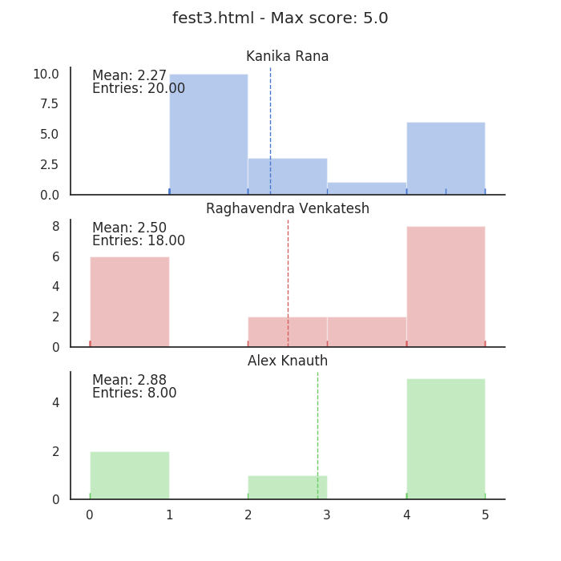

# Code Review Distribution Plots

## Grader Normalized Average by Assignment

- The x axis corresponds to the code review grade week webpage at [http://www.ccs.neu.edu/home/matthias/4500-f18/](http://www.ccs.neu.edu/home/matthias/4500-f18/)
- The y axis corresponds to the average grade given by the TA for the week, normalized from 0 to the maximum possible score for that week
- The weekly grades were often multimodal (see below), so error bars weren't included.
- Note that Kanika and Raghavendra grade 16-20 groups each week, and Alex grades ~8 each week

## Grader Average by Assignment

## Code Review Grades by Grader

- The x axis corresponds to the score given
- The y axis corresponds to the number of groups given that score
- Each of the following histograms correspond to a single week in the above plot.
- The scores are tallied into ~10-12 bins across the range [0, max_score] (excluding fest3.html, where there are 5 bins)

